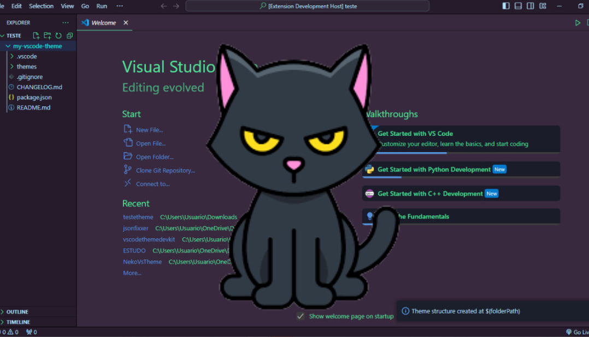

## VscodeThemeDevKit

Create a theme easily using our extension. To generate an ideal package for creating themes, it's very simple, just press ctrl shift p and type: vscodethemedevkit.createThemeStructure and then just pass the path to the directory where you want to create your theme.

and then your theme structure will be created and you can start editing it normally.